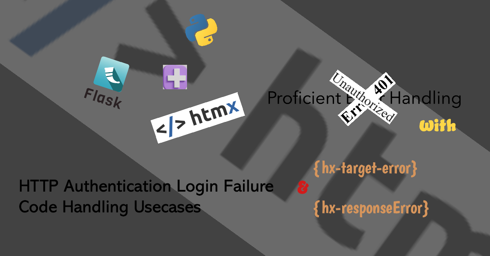

# HTTP Authentication login failure Return Code handling usecases - Proficient Error Handling with hx-target-error and hx-responseError

When comes to User experience while tries to perform login process, which provides individual identity and credential to gain access and authorisation via HTTP authentication framework. it's often poses challenge to provide helpful information to user hinting what had happened upon a login failure.

I wanted to add a form and then either show an error message if the form failed to submit, or play the "close modal" animation if the form created a new record successfully.

This round of article meant to demontrate 2 approaches to proficiently handle HTTP [client error responses][5] code, whenever submitted credential via form submission doesn't matched with users database.

## htmx 

Htmx gives us access to AJAX directly in HTML by using attributes and provides an extensive events system that can be used to modify and enhance behavior. As per article title, we'll focus on below [htmx extension][2] and [events][3] attributes.

- hx-target-error
> This extension allows you to specify different target elements to be swapped when different HTTP response codes are received.
- hx-responseError
> This event is triggered when an HTTP error response occurs

## HTTP return Code: 

HTTP [client error responses][5] code, specifically 401 Unauthorized inform client must authenticate itself to get the requested response. Generally it may return in many forms as below whenever there is any HTTP authentication failure.

### 401 Error variations:
- HTTP Error 401 Unauthorized
- 401 Unauthorized Error
- Error 401 Unauthorized
- Access Denied
- 401 Authorization Required

## How It Works:

This article were focusing with below 2 solutions. Both solutions provide unique way to handle HTTP resposne error to display desired message to users. htmx provides 2 htmx attributes capable to listens on error events, then perform certain action.


### solution with hx-target-error:

response-targets extension

This extension allows you to specify different target elements to be swapped when different HTTP response codes are received.

It uses attribute names in a form of hx-target-[CODE] where [CODE] is a numeric HTTP response code with the optional wildcard character at its end. You can also use hx-target-error, which handles both 4xx and 5xx response codes.

1. Install htmx extension package

```html
<script src="https://unpkg.com/htmx-ext-response-targets@2.0.0/response-targets.js"></script>
```

2. Add htmx hx-ext attribute into parent div element to enables an htmx extension and inherit to all child element.
3. Specify desired HTTP error code to handle by using hx-target-[CODE]. [CODE] allows to customise both 4xx and 5xx response codes. for this instance, hx-target-401 will be spedified, and target element id.
4. Specify hx-target element id to display your friendly message with successful authentication.

```python
  <div hx-ext="response-targets">

        <form hx-post="/login" hx-target-401="#responsediv" hx-target="div#responsediv">
            Username: <input name="Username"><br>
            Password: <input name="password" type=password><br>
            <button type="submit">Log In</button>
          </form>

    <div id="responsediv">
    </div>

  </div>
```

### solution with hx-responseError:

Htmx provides an extensive [events][3] system that can be used to modify and enhance behavior. "htmx:responseError" event triggered when an HTTP error response occurs. For this instance, java alert used to demonstrate the action to handling error with message prompt. success velidation return with submitted username.

Use hx-on attributes to embed scripts inline to respond to events directly on an element enable response-error trigger an action when HTTP response error received. 

```python
    <div>
        <form hx-post="/login" hx-on:htmx:response-error="alert('Incorrect Username or Password Credential')" hx-target="#success-div">
            Username: <input name="Username"><br>
            Password: <input name="password" type=password><br>
            <button type="submit">Log In</button>
          </form>
    </div>
```

```html
<body hx-on::responseError="event.detail.xhr.status === 404 ?event.detail.target = div#success-div"> 
```

## Final thoughts:

Both solutions generally allow to achieve similar outcome. 
By captures HTTP return client error responses from server, allows more granular use case control and error handles. 
Personally i'll lay towards hx-target-[error] to impplement as its given much more dynamic and flexiblity in adjusting and finetune whenever   


By taking avantage of either one solution 

there is many other method to handle HTTP error
i find with htmx more easy and 


## Install

```
clone

```


[1]: https://htmx.org/attributes/hx-ext/
[2]: https://extensions.htmx.org/
[3]: https://htmx.org/events/#htmx:responseError
[4]: https://developer.mozilla.org/en-US/docs/Web/HTTP/Authentication
[5]: https://developer.mozilla.org/en-US/docs/Web/HTTP/Status#client_error_responses
[6]: https://serjhenrique.com/create-dependent-dropdown-with-django-and-htmx/
[7]: https://htmx.org/attributes/hx-on/

---

The error handling was pretty straightforward, I just used the sendError and responseError events. It's the success handling portion that's giving me a hard time.

At the moment, returning Failure from an AuthenticationHandler results in a 401 Challenge response

HTTP provides a general framework for access control and
   authentication, via an extensible set of challenge-response
   authentication schemes, which can be used by a server to challenge a
   client request and by a client to provide authentication information.

   ```html
<body hx-on::responseError="event.detail.xhr.status === 404 ?event.detail.target = true : undefined"> 
```